# Sprout — *Fuel the Good*

A design case study for **Sprout**, a calorie tracker and recipe finder, delivered in three
connected parts: a **stylescape** that sets the visual direction, a **design system** that turns
that direction into tokens and components, and a **clickable prototype** that assembles those
components into ten working screens with light and dark themes.

Everything is plain HTML and CSS. There is no build step, no framework and no dependency beyond
two Google Fonts — open any `.html` file directly in a browser.

```
design-system/
├── index.html          ← prototype entry point
├── components.html     ← design system styleguide
├── README.md           ← full design system documentation (rationale, ratios, usage)
├── tokens.css          ← every design decision as a CSS custom property
├── components.css      ← every component, built only from tokens
├── prototype.css       ← device frame and prototype-only chrome
├── theme.js            ← writes [data-theme] before first paint
├── components.js       ← styleguide-only interactions
├── screens/            ← the ten prototype screens
├── assets/dishes/      ← photography used by the recipe and product screens
└── stylescape/         ← the stylescape image
screenshots/            ← screenshots referenced by this README
```

---

## 1. Stylescape

**Figma file:** _<!-- paste the Figma link here -->_

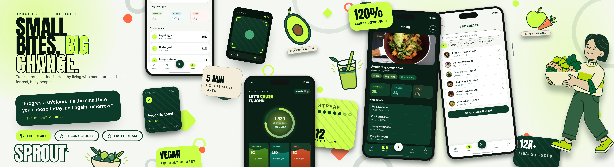

The stylescape is the origin point of the whole project. It fixes the mood before a single
component exists: a lime-on-forest palette with warm cream and orange accents, generous rounded
geometry, condensed display type against a humanist sans, and food photography shot on light,
natural backgrounds.

It is not decoration — it is the source of truth for the palette. Every colour primitive in
`tokens.css` was **sampled from this image** rather than chosen by eye: the lime CTA became
`--lime-500`, the confetti dots became `--orange-500`, the dark tracker chrome became
`--forest-900`, and the canvas became `--sage-100`.

---

## 2. Design system

**Entry point:** [`design-system/components.html`](design-system/components.html)
**Documentation:** [`design-system/README.md`](design-system/README.md)

A live styleguide that renders every component in every state, in both themes. It consumes
nothing but `tokens.css` and `components.css` — the exact same files the prototype uses, so the
styleguide can never drift from the product.

The system is built in three token layers: **primitives** (raw sampled palette) →
**semantic** (role-based: `--surface-brand`, `--text-lime`) → **component** (per-component knobs
such as `--btn-radius`). Components are written against layers 2 and 3 only, which is why adding
the dark theme cost seventeen lines of component CSS — every colour token is a `light-dark()`
pair, and `color-scheme` picks the half.

Accessibility is part of the system rather than a pass over it: every contrast ratio in the
documentation is computed from the sampled hex values with the WCAG 2.1 formula, lime is defined
as a *fill and never a text colour* (1.09:1 as text on canvas), state is never signalled by
colour alone, and tap targets are verified.

**What the styleguide covers:** theming · colour · accessibility audit · typography · spacing,
radius & elevation · buttons · pill tags & badges · segmented control · inputs & search · portion
adjuster · cards · calorie progress ring · macro stat cards · stat readout · weekly chart · streak
indicator & modal · list items · instruction steps · scan viewfinder · bottom navigation · screen
header · screens in composition.

### Opening it

```bash
start design-system/components.html      # Windows
open  design-system/components.html      # macOS

# or serve the folder, if your browser restricts local files
python -m http.server 8000
# → http://localhost:8000/design-system/components.html
```

The styleguide carries its own floating theme toggle, so every component can be checked in auto,
light and dark without leaving the page.

### Screenshots

| Tokens & colour | Typography |
|:---:|:---:|
| 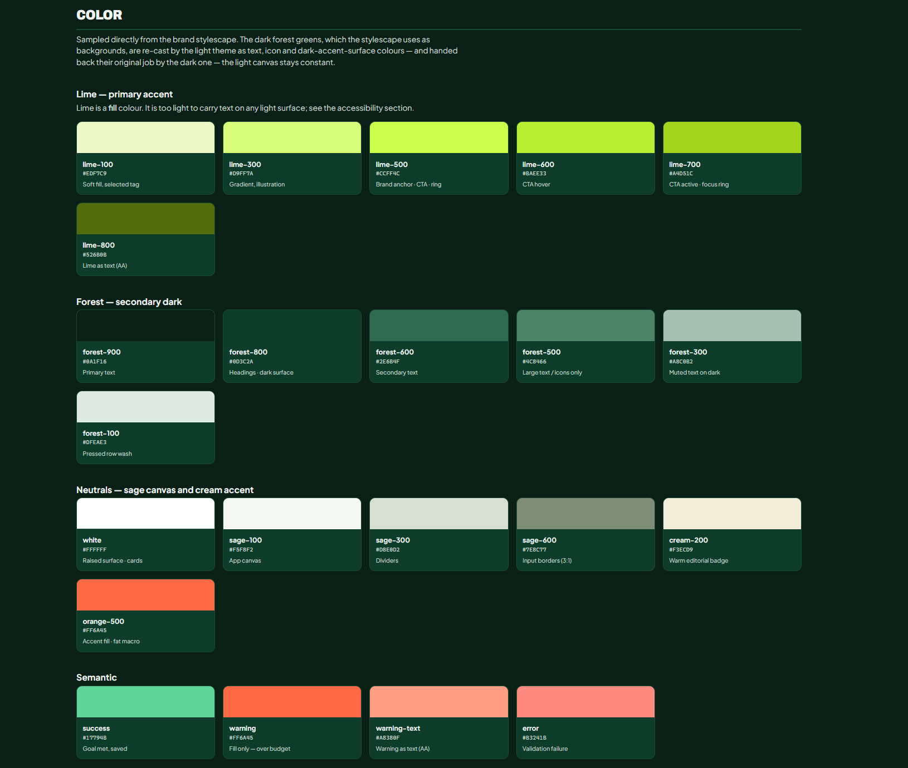 | 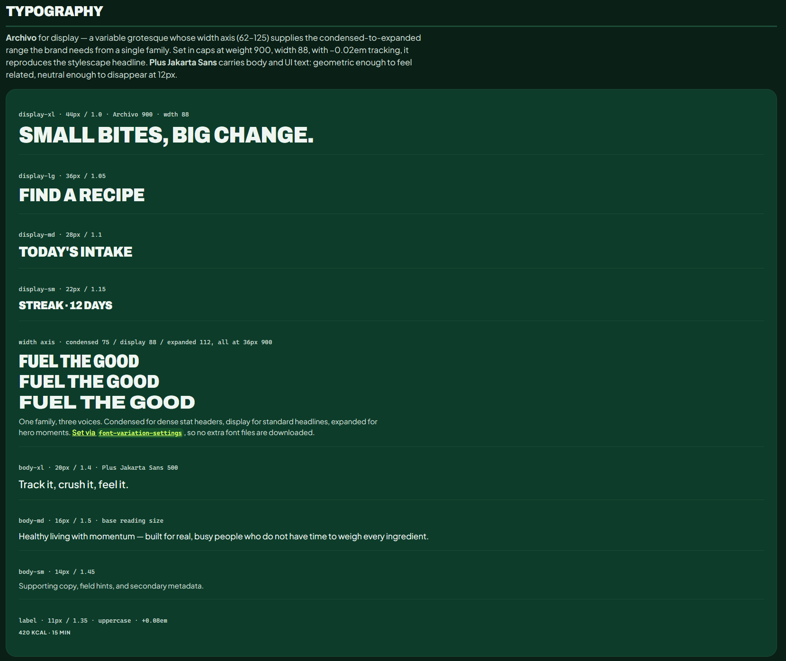 |

| Buttons, tags & controls | Cards & data display |
|:---:|:---:|
| 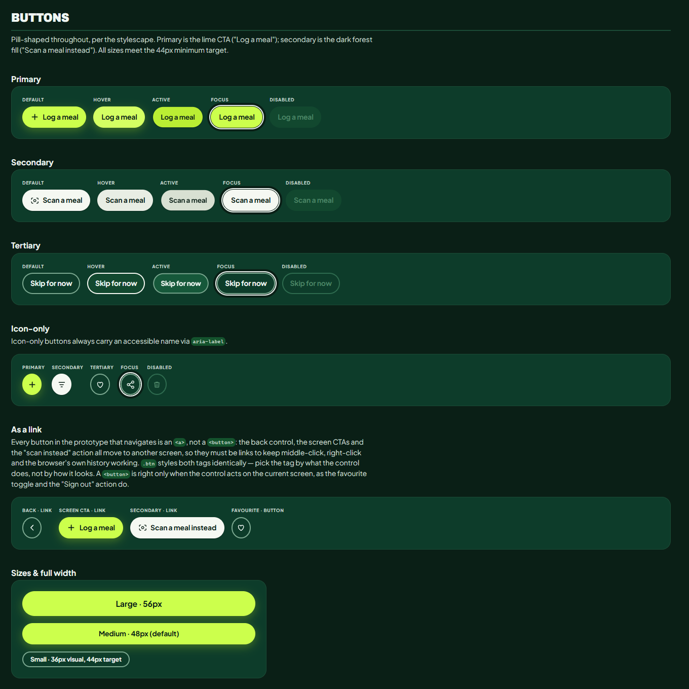 | 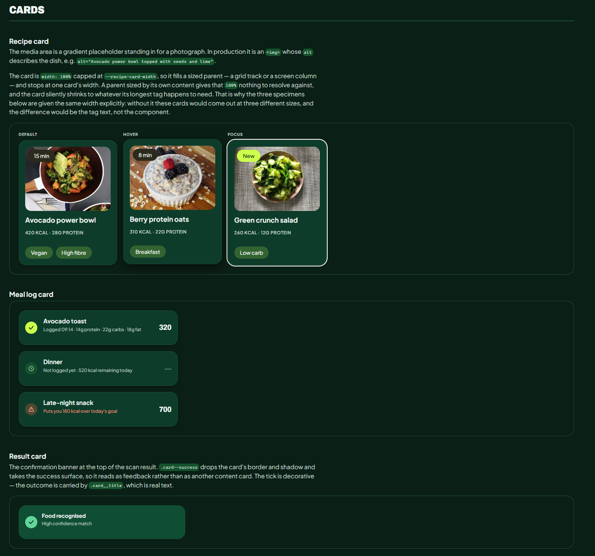 |

| Accessibility audit | Dark theme |
|:---:|:---:|
| 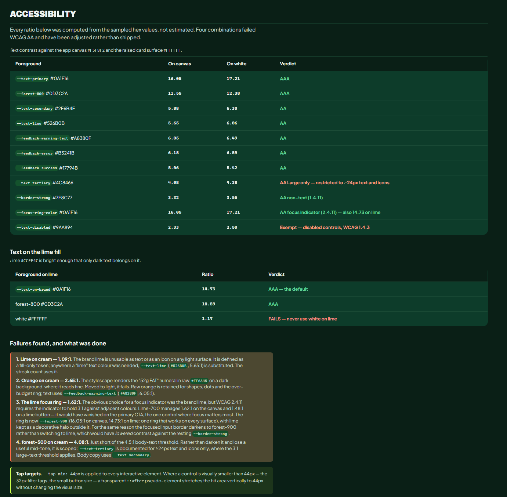 | 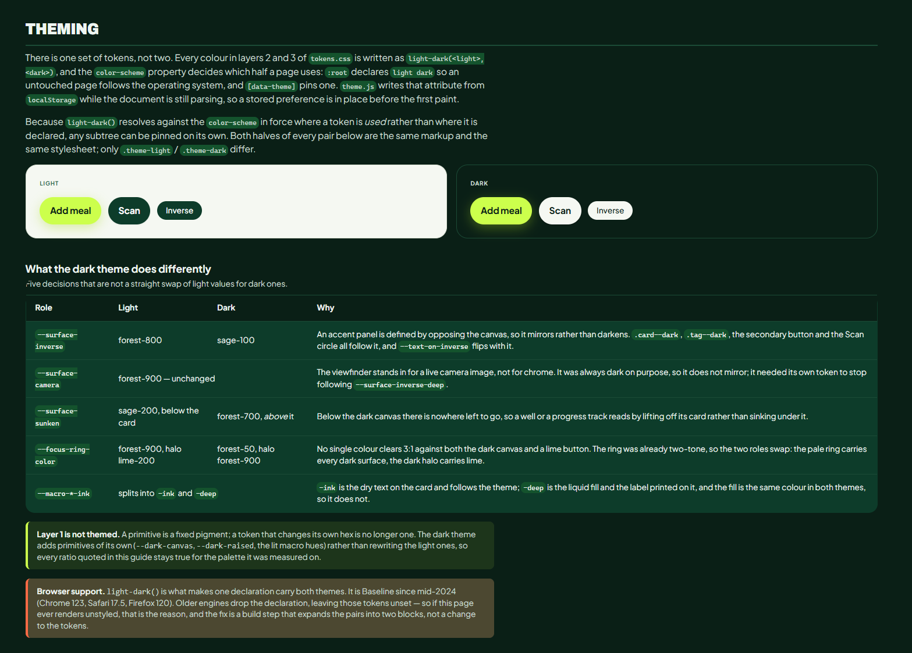 |

---

## 3. Prototype

**Entry point:** [`design-system/index.html`](design-system/index.html)

The index page is a map of the prototype: it lists both user journeys step by step, and every step
is a link into the real screen. From there the in-screen back arrow and the bottom navigation work
exactly as they would in the app, so the flows can be walked end to end rather than clicked
through as a slideshow.

Ten screens, all rendered from the same `tokens.css` and `components.css` as the styleguide, each
inside a phone device frame.

### Opening it

```bash
start design-system/index.html      # Windows
open  design-system/index.html      # macOS

# or serve the folder, if your browser restricts local files
python -m http.server 8000
# → http://localhost:8000/design-system/index.html
```

### Flows

**Flow 1 — Calculate the calories in a dish.** Two alternative paths from the same entry point:

- **Path A — Scan:** Today → Scan → Recognition result → back to Today
- **Path B — Manual search:** Today → Add meal → Product detail → back to Today

**Flow 2 — Find a suitable recipe:** Today → Find a recipe → Recipe detail → back to Today

All three paths converge on `home.html`. That convergence is the point of the prototype: logging by
camera, by search, or from a recipe all return the user to the same Today screen they started on.

### Themes

The prototype ships **three appearance modes, not two**: `auto`, `light` and `dark`. Auto is a real
setting that keeps following the OS after sunset, so the floating toggle cycles
auto → light → dark rather than flipping a two-way switch with no way back. The **You** screen
exposes the same setting as three named options in a segmented control.

`theme.js` loads in `<head>` **without `defer`** and writes a single `[data-theme]` attribute from
`localStorage` before the document paints — a stored dark preference otherwise lands after the
browser has already drawn a light page, producing a flash on every load. Everything else about
theming is CSS.

### Screens

| # | Screen | File | What it is |
|---|---|---|---|
| 1 | Today | [`screens/home.html`](design-system/screens/home.html) | Home tab: calorie progress ring, macro chips, streak and the day's meal log. The hub every flow returns to. |
| 2 | Scan | [`screens/scan.html`](design-system/screens/scan.html) | Camera viewfinder for photographing a dish. |
| 3 | Scan result | [`screens/scan-result.html`](design-system/screens/scan-result.html) | Recognition result with the detected dish and portion adjuster, ready to log. |
| 4 | Add meal | [`screens/add-meal.html`](design-system/screens/add-meal.html) | Manual search over the food database, with recent and suggested entries. |
| 5 | Product detail | [`screens/product-detail.html`](design-system/screens/product-detail.html) | Nutrition breakdown for a single product, with portion selection and log action. |
| 6 | Find a recipe | [`screens/find-recipe.html`](design-system/screens/find-recipe.html) | Recipe browser with filter chips and recipe cards. |
| 7 | Recipe detail | [`screens/recipe-detail.html`](design-system/screens/recipe-detail.html) | Full recipe: hero photography, nutrition, ingredients and numbered method steps. |
| 8 | Stats | [`screens/stats.html`](design-system/screens/stats.html) | Standing tab: weekly and monthly charts, daily averages, consistency and the streak modal. |
| 9 | You | [`screens/you.html`](design-system/screens/you.html) | Standing tab: profile, goals and preferences, including the appearance setting. |
| 10 | Prototype index | [`index.html`](design-system/index.html) | The flow map and entry point into everything above. |

Screens 8 and 9 are standing tabs — reachable from the bottom navigation on every screen, and not
part of either flow.

### Screenshots

**Flow 1 — Path A (Scan)**

| Today | Scan | Scan result |
|:---:|:---:|:---:|
| 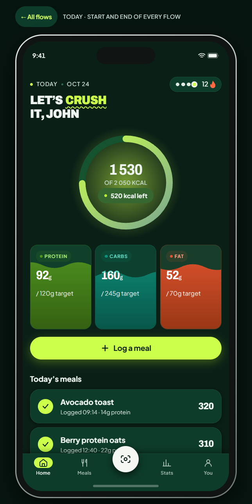 | 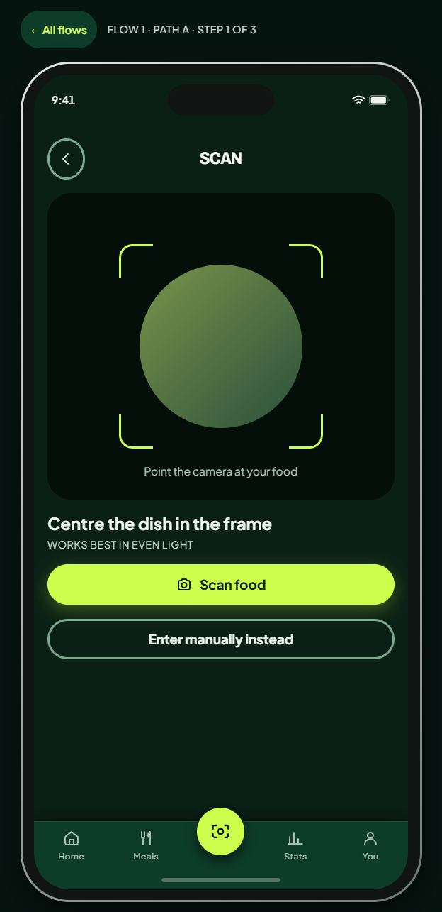 | 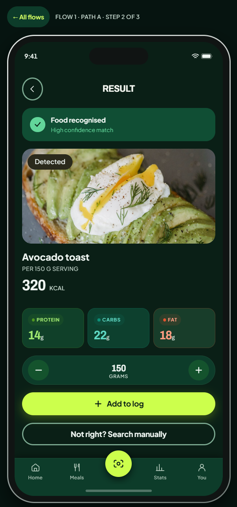 |

**Flow 1 — Path B (Manual search)**

| Add meal | Product detail |
|:---:|:---:|
| 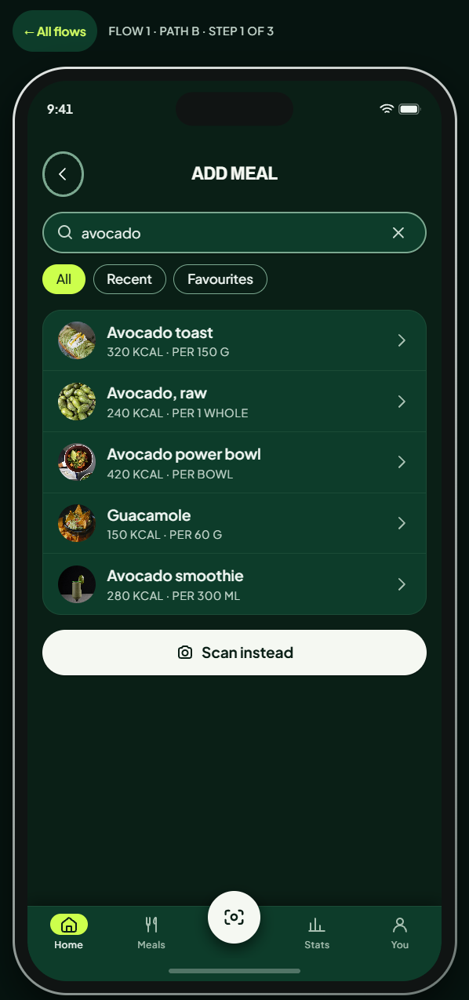 | 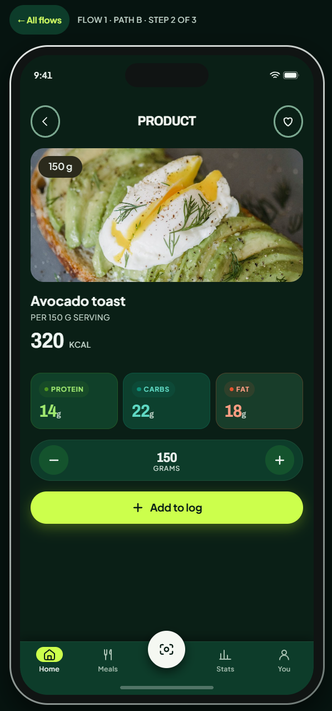 |

**Flow 2 — Find a recipe**

| Find a recipe | Recipe detail |
|:---:|:---:|
| 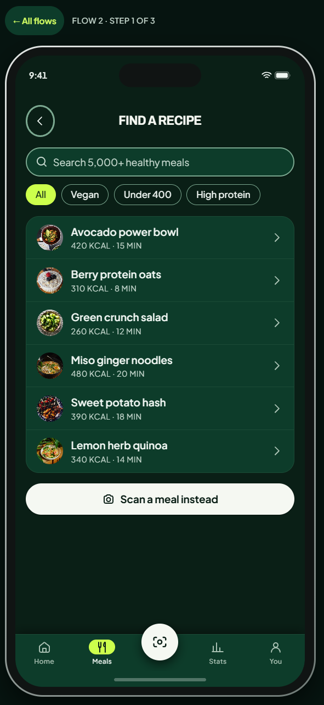 | 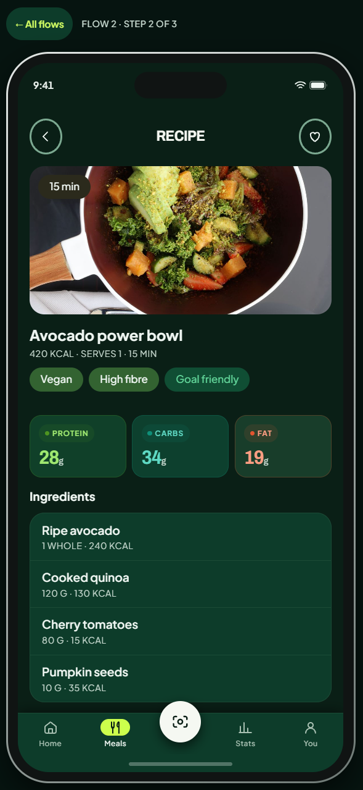 |

**Standing tabs**

| Stats | You |
|:---:|:---:|
| 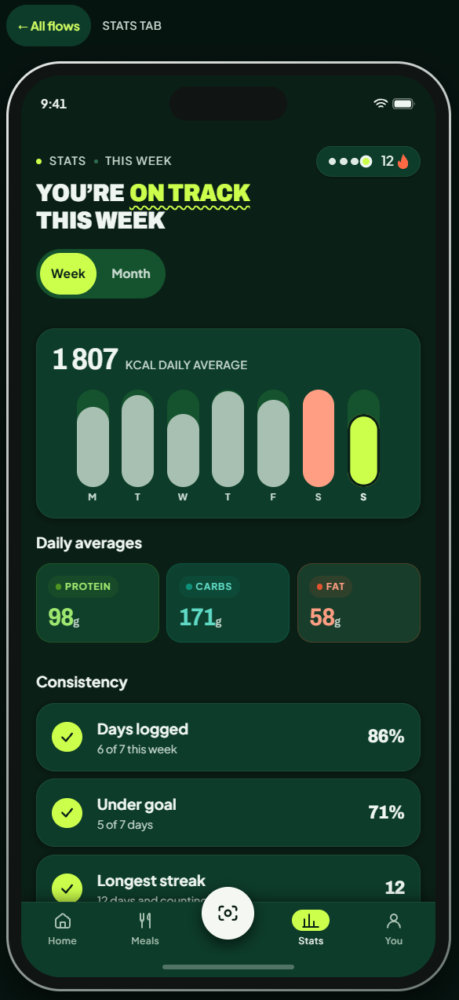 | 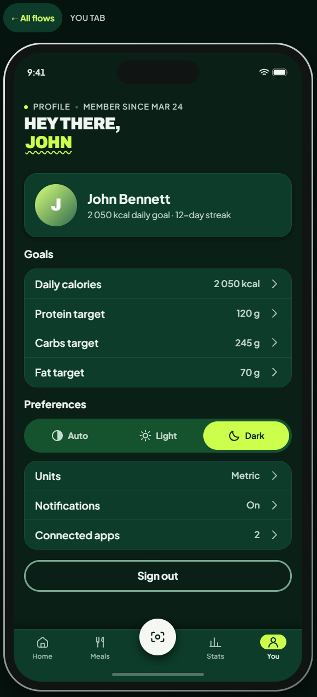 |

**Light and dark**

| Light theme | Dark theme |
|:---:|:---:|
| 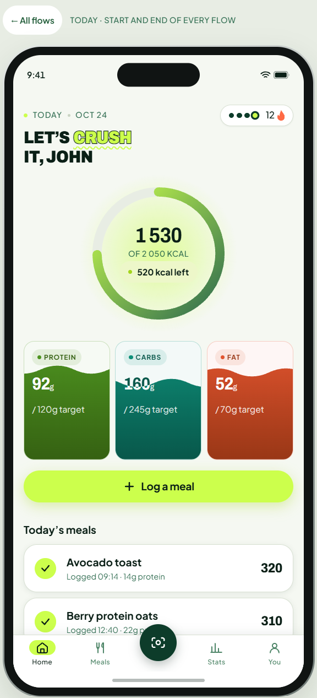 | 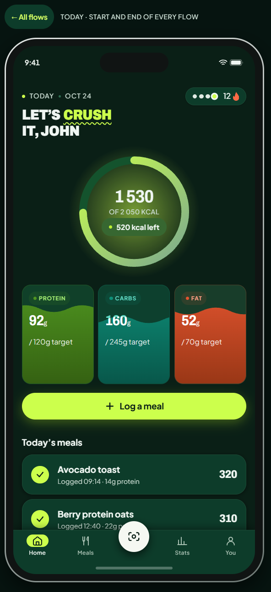 |
